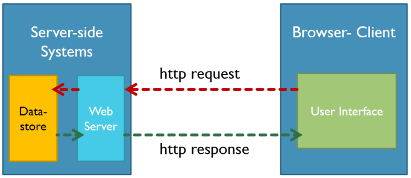

# Dynamic Web-application with Node.js

- Requests and Responses
- Mapping Requests
- Dynamic Web Applications
- Embedded JavaScript (EJS)
- Creating a Simple Web Server
- Using NPM to Install Libraries
- Scaffolding an Express.js Web App
- Understanding Routes and Actions
- Serving HTTP Responses

## 💛 Requests and Responses

Requests và Responses là hai khái niệm quan trọng trong giao thức HTTP (Hypertext Transfer Protocol) và liên quan đến việc gửi và nhận dữ liệu giữa máy chủ (server) và người dùng (client) trong môi trường web.



1. Requests (Yêu cầu):
   - Requests là các thông điệp gửi từ người dùng (client) đến máy chủ (server) để yêu cầu một hành động nào đó.
   - Yêu cầu (request) có thể bao gồm các thông tin như URL, phương thức (method), tiêu đề (headers), thân (body) và các tham số khác.
   - Các phương thức yêu cầu phổ biến trong HTTP bao gồm GET, POST, PUT, DELETE, PATCH, và HEAD. Mỗi phương thức có mục đích và cách sử dụng riêng.

2. Responses (Phản hồi):
   - Responses là các thông điệp được máy chủ (server) gửi lại cho người dùng (client) sau khi nhận được yêu cầu.
   - Phản hồi (response) chứa các thông tin như mã trạng thái (status code), tiêu đề (headers), và nội dung (body) của phản hồi.
   - Mã trạng thái (status code) là một số ba chữ số thể hiện kết quả của yêu cầu, ví dụ: 200 OK (yêu cầu thành công), 404 Not Found (không tìm thấy tài nguyên), 500 Internal Server Error (lỗi máy chủ), vv.

Khi một người dùng truy cập một trang web, trình duyệt của người dùng sẽ gửi các yêu cầu đến máy chủ, và máy chủ sẽ gửi lại các phản hồi tương ứng. Các yêu cầu và phản hồi này cùng nhau tạo thành quá trình trao đổi thông tin giữa máy chủ và người dùng trong môi trường web.

## 💛 Mapping Requests

Mapping requests (định tuyến yêu cầu) là quá trình xác định cách xử lý các yêu cầu HTTP đến các địa chỉ URL cụ thể trong một ứng dụng web. Trong ngữ cảnh của một ứng dụng web, "mapping" ám chỉ việc liên kết (mapping) các yêu cầu từ người dùng đến các tác vụ xử lý tương ứng.

Khi một yêu cầu HTTP được gửi đến máy chủ, máy chủ cần biết xử lý yêu cầu đó bằng cách nào. Mapping requests giúp xác định điểm cuối (endpoints) trong ứng dụng web mà yêu cầu sẽ được chuyển đến để xử lý.

Trong các framework phát triển ứng dụng web, như Node.js với Express, Django trong Python, ASP.NET trong C#, hay Ruby on Rails, việc mapping requests thường được thực hiện thông qua các route (đường dẫn) và các hàm xử lý tương ứng.

Ví dụ, trong Express framework của Node.js, bạn có thể định nghĩa các route và các hàm xử lý tương ứng như sau:

```javascript
const express = require('express');
const app = express();

// Định nghĩa route và hàm xử lý cho yêu cầu GET đến đường dẫn '/'
app.get('/', (req, res) => {
  res.send('Hello, World!');
});

// Định nghĩa route và hàm xử lý cho yêu cầu POST đến đường dẫn '/users'
app.post('/users', (req, res) => {
  // Xử lý yêu cầu tạo người dùng mới
});

// ...các route và hàm xử lý khác

app.listen(3000, () => {
  console.log('Server is running on port 3000');
});
```

Trong ví dụ trên, các yêu cầu GET đến đường dẫn '/' sẽ được chuyển đến hàm xử lý liên kết, và các yêu cầu POST đến đường dẫn '/users' sẽ được chuyển đến hàm xử lý tạo người dùng mới.

Việc mapping requests đóng vai trò quan trọng trong việc quyết định xử lý yêu cầu của người dùng và cung cấp phản hồi tương ứng trong ứng dụng web.

## 💛 Dynamic Web Applications

Dưới đây là một ví dụ đơn giản về cách tạo một máy chủ web đơn giản bằng Node.js

```js
const http = require('http');

const server = http.createServer((req, res) => {
  // Xử lý yêu cầu
  if (req.url === '/') {
    res.writeHead(200, { 'Content-Type': 'text/html' });
    res.write('<h1>Hello, World!</h1>');
    res.end();
  } else if (req.url === '/about') {
    res.writeHead(200, { 'Content-Type': 'text/html' });
    res.write('<h1>About Page</h1>');
    res.end();
  } else {
    res.writeHead(404, { 'Content-Type': 'text/html' });
    res.write('<h1>404 Not Found</h1>');
    res.end();
  }
});

server.listen(3000, () => {
  console.log('Server is running on port 3000');
});
```

Nhưng với cách này thì rất khó khắn để tạo ra một ứng dụng web

## 💛Embedded JavaScript (EJS)

Cài đặt

```bash
npm install ejs
yarn add ejs
```

Sau khi đã cài đặt EJS, bạn có thể sử dụng nó để tạo các trang HTML động trong ứng dụng Node.js của bạn. Dưới đây là một ví dụ cụ thể:

```js
const http = require('http');
const fs = require('fs');
const url = require('url');
const path = require('path');
const ejs = require('ejs');

const server = http.createServer((req, res) => {
  // Xử lý yêu cầu
  const parsedUrl = url.parse(req.url);
  const pathname = parsedUrl.pathname;

  if (pathname === '/') {
    const template = fs.readFileSync('index.ejs', 'utf8');
    const renderedHTML = ejs.render(template, { message: 'Hello, World!' });
    res.writeHead(200, { 'Content-Type': 'text/html' });
    res.write(renderedHTML);
    res.end();
  } else {
    res.writeHead(404, { 'Content-Type': 'text/html' });
    res.write('<h1>404 Not Found</h1>');
    res.end();
  }
});

server.listen(3000, () => {
  console.log('Server is running on port 3000');
});
```

Trong ví dụ trên, chúng ta đã thêm module EJS và sử dụng nó để tạo các trang HTML động. Chúng ta đọc nội dung của tệp template.ejs, sử dụng ejs.render() để tạo HTML động dựa trên template và dữ liệu cung cấp. Trong trường hợp này, chúng ta truyền một đối tượng { message: 'Hello, World!' } cho EJS.

Lưu ý rằng chúng ta tạo ra một tệp tin template.ejs riêng biệt để chứa template EJS. Nội dung của tệp tin này có thể là một đoạn mã HTML thông thường với các thẻ EJS để nhúng mã JavaScript và hiển thị dữ liệu động.

Ví dụ về index.ejs:

```html
<!DOCTYPE html>
<html>
<head>
  <title>Dynamic Page</title>
</head>
<body>
  <h1><%= message %></h1>
</body>
</html>
```
Trong trường hợp này, chúng ta sử dụng thẻ <%= message %> để hiển thị nội dung của biến message mà chúng ta truyền vào từ mã JavaScript.

Khi bạn chạy ứng dụng và truy cập http://localhost:3000, bạn sẽ thấy trang HTML được tạo động với nội dung "Hello, World!" từ biến message.

Điều này cho phép bạn tạo các trang HTML phức tạp hơn với EJS và cung cấp dữ liệu động cho chúng.

## 💛Creating a Simple Web Server

Để tạo một  Web Server đơn giản trong Node.js

Bạn tạo một file server.js

```js
const http = require('http');

const server = http.createServer((req, res) => {
  // Handling requests
  res.statusCode = 200;
  res.setHeader('Content-Type', 'text/plain');
  res.end('Hello, World!\n');
});

server.listen(3000, 'localhost', () => {
  console.log('Server is running on port 3000');
});

```

Chạy server này bằng cách, nhập lệnh này ở Terminal

```bash
node server.js
```

## 💛Using NPM to Install Libraries

npm (Node Package Manager) là một trình quản lý gói cho Node.js, cho phép bạn quản lý và cài đặt các thư viện, frameworks, và công cụ khác cho dự án Node.js của bạn. npm là một phần của cài đặt Node.js và được cung cấp sẵn khi bạn cài đặt Node.js trên máy tính của mình.

Dưới đây là một số khái niệm cơ bản và chức năng quan trọng của npm:

1. Gói (Package): npm sử dụng khái niệm "gói" để đại diện cho một module hoặc thư viện Node.js. Mỗi gói có thể chứa mã nguồn, tệp tin cấu hình, tài liệu, và các tài nguyên khác liên quan.

2. `package.json`: Mỗi dự án Node.js có một tệp `package.json` đặc tả thông tin về dự án và các phụ thuộc của nó. Tệp `package.json` chứa tên dự án, phiên bản, tác giả, mô tả, các phụ thuộc và nhiều thông tin khác. Bạn cũng có thể định nghĩa các tác vụ (scripts) tùy chỉnh để thực hiện các tác vụ như biên dịch, chạy kiểm tra, và triển khai.

3. Quản lý phụ thuộc (Dependency Management): npm cho phép bạn quản lý các phụ thuộc của dự án một cách dễ dàng. Bạn có thể chỉ định các phụ thuộc trong `package.json` và npm sẽ tự động tải về và cài đặt chúng từ Registry (kho lưu trữ npm chính thức).

4. Cài đặt gói: Bằng cách sử dụng lệnh `npm install`, bạn có thể cài đặt các gói từ Registry hoặc từ một URL hoặc tệp tin cục bộ. npm sẽ tải về gói và cài đặt chúng vào thư mục `node_modules` của dự án.

5. Công bố gói: Bạn có thể công bố gói của mình lên Registry để chia sẻ với cộng đồng Node.js. Người khác có thể cài đặt và sử dụng gói của bạn bằng cách chạy `npm install <tên-gói>`.

6. Tìm kiếm gói: npm cung cấp khả năng tìm kiếm gói từ Registry. Bạn có thể sử dụng `npm search` hoặc truy cập trang web npm để tìm kiếm các gói phù hợp với nhu cầu của mình.

7. Quản lý phiên bản: npm cho phép bạn quản lý và nâng cấp phiên bản gói. Bạn có thể cập nhật phiên bản gói hoặc kiểm soát phiên bản cụ thể được cài đặt trong dự án của mình.

Ngoài NPM ra chúng ta còn có một số công cụ khác, ví dụ như yarn

## 💛Scaffolding an Express.js Web App

ExpressJS là một framework ứng dụng web có mã nguồn mở và miễn phí được xây dựng trên nền tảng Node.js. ExpressJS được sử dụng để thiết kế và phát triển các ứng dụng web một cách nhanh chóng.


Nói đến framework là nói đến nó có thể vừa đảm nhận vai trò làm client vừa làm server được.

ExpressJS Rất dễ học, chỉ cần bạn biết JavaScript, bạn sẽ không cần phải học một ngôn ngữ mới, giúp cho việc phát triển back-end dễ dàng hơn nhiều.

**Cách cài đặt**


```bash
yarn add express --save
```

Tại thư mục dự án tạo một file app.js với nội dung sau

```js
const express = require('express');
const app = express();
const port = 3000;

app.get('/', (req, res) => {
  res.send('Hello World!');
});

app.listen(port, () => {
  console.log(`Example app listening on port ${port}`);
});
```

Như vậy chỉ vài dòng code đơn giản , bản đã tạo được một server chạy trên môi trường NodeJs

## 💛Understanding Routes and Actions


Route là một thành phần cực kỳ quan trọng của một website, nó giúp website biết được người dùng truy cập đến nơi nào của trang web, từ đó phản hồi lại một cách thích hợp.

Cú pháp định nghĩa một Route

```js
app.METHOD(PATH, HANDLER);
```

- app is an instance of express.
- METHOD is an HTTP request method, in lowercase.
- PATH is a path on the server.
- HANDLER is the function executed when the route is matched.

Ví dụ:

Phản hồi khi có một truy cập đến trang chủ với phương thức GET

```js
app.get('/', (req, res) => {
  res.send('Hello World!. I\'m a Home Page');
});
```

Phản hồi khi có một truy cập đến trang chủ với phương thức POST

```js
app.post('/', (req, res) => {
  res.send('Got a POST request');
});
```

Phản hồi khi có một truy cập đến trang user với phương thức PUT

```js
app.put('/user', (req, res) => {
  res.send('Got a PUT request at /user');
});
```

Phản hồi khi có một truy cập đến trang user với phương thức DELETE

```js
app.delete('/user', (req, res) => {
  res.send('Got a DELETE request at /user');
});
```

Đọc thêm: [So sánh GET với POST](https://timoday.edu.vn/cac-phuong-thuc-request-trong-giao-thuc-http/#So_sanh_GET_voi_POST)

## 💛 Route paths

Ngoài cách bạn định nghĩa path một cách cụ thể như ví dụ trên thì bạn có thể tạo ra các `path` với một `string patterns`


route path sẽ khớp với: acd, abcd.

```js
app.get('/ab?cd', (req, res) => {
  res.send('ab?cd');
});
```

route path khớp với abcd, abbcd, abbbcd, và nhiều hơn

```js
app.get('/ab+cd', (req, res) => {
  res.send('ab+cd');
});
```

route path khớp với abcd, abxcd, abRANDOMcd, ab123cd, và nhiều hơn

```js
app.get('/ab*cd', (req, res) => {
  res.send('ab*cd');
});
```

route path khớp với /abe and /abcde.

```js
app.get('/ab(cd)?e', (req, res) => {
  res.send('ab(cd)?e');
});
```

Hoặc khớp với một biểu thức chính quy `regular expressions`:

route path khớp khi url có chứa ký tự `a`

```js
app.get(/a/, (req, res) => {
  res.send('/a/');
});
```

route path khớp khi url như butterfly, dragonfly, và không khớp khi butterflyman, dragonflyman. $ là đánh dấu là kết thúc.

```js
app.get(/.*fly$/, (req, res) => {
  res.send('/.*fly$/');
});
```

Regex rule trong trường hợp sử dụng  route parameter

```js
// Ví dụ: /user/1
app.get('^/users/:userId([0-9]{6})', function (req, res) {
  res.send('Route match for User ID: ' + req.params.userId);
});
```

```js
// Ví dụ: /user/aptech
app.get('^/users/:username([0-9a-zA-Z]{6,12})', function (req, res) {
  res.send('Route match for User Name: ' + req.params.username);
});
```

## 💛Serving HTTP Responses

HTTP Response có cấu tạo gồm ba phần chính. Đó là status line, header và massage body

1. Request Line: Http Status Code, Reason-Phrase, HTTP version

2. Request Header: thông tin mở rộng cho request: cookie, thông tin về ủy quyền, tác nhân người dùng…

3. Message Body

ExpressJs hỗ trợ các phương thức response như sau:

| Method           | Description                                                                           |
| ---------------- | ------------------------------------------------------------------------------------- |
| res.download()   | Tải file.                                                       |
| res.end()        | Kết thúc xử lý reponse                                                            |
| res.json()       | Gửi một Json                                                                 |
| res.jsonp()      | Send a JSON response with JSONP support.                                              |
| res.redirect()   | Chuyển hướng request                                                                   |
| res.render()     | Render một giao diện                                                               |
| res.send()       | Send a response of various types.                                                     |
| res.sendFile()   | Send a file as an octet stream.                                                       |
| res.sendStatus() | Set the response status code and send its string representation as the response body. |

###  Tìm hiểu về HTTP Status Code

Khi nhận và phiên dịch một HTTP Request, Server sẽ gửi tín hiệu phản hồi là một HTTP Response, trong đó có một thành phần là Status code.

Status code (Mã hóa trạng thái thường được gọi là mã trạng thái) là một số nguyên 3 ký tự, trong đó ký tự đầu tiên của Status-Code định nghĩa loại Response và hai ký tự cuối không có bất cứ vai trò phân loại nào. Có 5 giá trị của ký tự đầu tiên:

- 1xx: Information (Thông tin): Khi nhận được những mã như vậy tức là request đã được server tiếp nhận và quá trình xử lý request đang được tiếp tục.
- 2xx: Success (Thành công): Khi nhận được những mã như vậy tức là request đã được server tiếp nhận, hiểu và xử lý thành công
- 3xx: Redirection (Chuyển hướng): Mã trạng thái này cho biết client cần có thêm action để hoàn thành request
- 4xx: Client Error (Lỗi Client): Nó nghĩa là request chứa cú pháp không chính xác hoặc không được thực hiện.
- 5xx: Server Error (Lỗi Server): Nó nghĩa là Server thất bại với việc thực hiện một request nhìn như có vẻ khả thi

Xem chi tiết [link sau](http-status-code.md)
