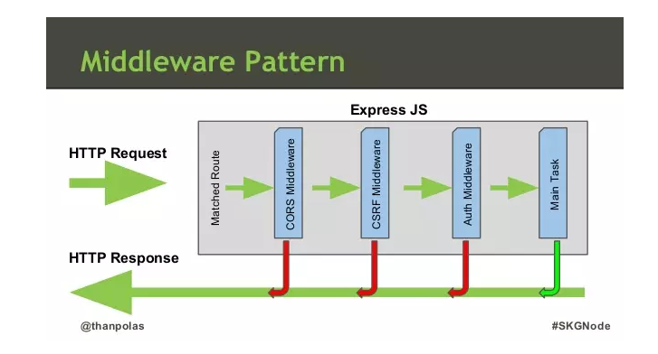

# Tạo web động sử dụng NodeJs - ExpressJs

Trong bài học này chúng ta tìm hiểu: 

- Express.js
- Middleware and Serving Static Files
- Using Template Engine – Jade 
- Using Template Engine – EJS
- Adding Responsiveness with Bootstrap
- Handling Parameters

==============================

## 💛 1. Giới thiệu về ExpressJs

ExpressJS là một framework ứng dụng web có mã nguồn mở và miễn phí được xây dựng trên nền tảng Node.js. ExpressJS được sử dụng để thiết kế và phát triển các ứng dụng web một cách nhanh chóng.


Nói đến framework là nói đến nó có thể vừa đảm nhận vai trò làm client vừa làm server được.

ExpressJS Rất dễ học, chỉ cần bạn biết JavaScript, bạn sẽ không cần phải học một ngôn ngữ mới, giúp cho việc phát triển back-end dễ dàng hơn nhiều.

**Cách cài đặt**


```bash
yarn add express --save
```
Hoặc bạn có thể cài đặt qua gói mẫu sẵn của express 

```js
npx express-generator
```

Gói này sinh ra cho bạn một project với cấu trúc thư mục chuẩn của express

## 💛  Middleware and Serving Static Files
### 🔶 3.0 Middleware là gì ?

Trong lấp trình ứng dụng WEB, Middleware sẽ đóng vai trò trung gian giữa request/response (tương tác với người dùng) và các xử lý logic bên trong web server.

Middleware sẽ là các hàm được dùng để tiền xử lý, lọc các request trước khi đưa vào xử lý logic hoặc điều chỉnh các response trước khi gửi về cho người dùng.



Hình trên mô tả 3 middleware có trong ExpressJS. Một request khi gửi đến Express sẽ được xử lý qua 5 bước như sau :

1. Tìm Route tương ứng với request
2. Dùng CORS Middleware để kiểm tra cross-origin Resource sharing của request
3. Dùng CRSF Middleware để xác thực CSRF của request, chống fake request
4. Dùng Auth Middleware để xác thực request có được truy cập hay không
5. Xử lý công việc được yêu cầu bởi request (Main Task)

Bất kỳ bước nào trong các bước 2,3,4 nếu xảy ra lỗi sẽ trả về response thông báo cho người dùng, có thể là lỗi CORS, lỗi CSRF hay lỗi auth tùy thuộc vào request bị dừng ở bước nào.

**Middleware trong ExpressJS** về cơ bản sẽ là một loạt các hàm Middleware được thực hiện liên tiếp nhau. Sau khi đã thiết lập, các request từ phía người dùng khi gửi lên ExpressJS sẽ thực hiện lần lượt qua các hàm Middleware cho đến khi trả về response cho người dùng. Các hàm này sẽ được quyền truy cập đến các đối tượng đại diện cho Request - req, Response - res, hàm Middleware tiếp theo - next, và đối tượng lỗi - err nếu cần thiết.

Một hàm Middleware sau khi hoạt động xong, nếu chưa phải là cuối cùng trong chuỗi các hàm cần thực hiện, sẽ cần gọi lệnh next() để chuyển sang hàm tiếp theo, bằng không xử lý sẽ bị treo tại hàm đó.

Trong Express, có 5 kiểu middleware có thể sử dụng :

- Application-level middleware (middleware cấp ứng dụng)
- Router-level middleware (middlware cấp điều hướng - router)
- Error-handling middleware (middleware xử lý lỗi)
- Built-in middleware (middleware sẵn có)
- Third-party middleware (middleware của bên thứ ba)

#### 🌻 3.1 Cách để tạo ra một middleware theo nhu cầu

Tại thư mục middleware, tạo một file tên: mylogger.middleware.js

```js
//Tạo và export luôn
module.exports = function (req, res, next) {
  //Logic Here
  console.log('LOGGED', req);

  //Có thể gắn Thêm vào request một biến
  req.aptech = { name: 'Softech', add: '38 yen bai' };

  //End with next() -> chuyển tiếp sang middleware khác nếu có
  next();
};
```

#### 🌻 3.2 Gắn middleware vào Application

Tại express app

```js
const myLogger require('./middlewares/mylogger.middleware');

//Gắn middleware vào app
app.use(myLogger);
```

#### 🌻 3.3 Lớp middleware

Tạo thêm 2 ví dụ về middleware nữa để thấy được sự chuyển tiếp giữa các lớp middleware

#### 🌻 3.4 Express middleware

Sử dụng các thư viện phổ biến để làm middleware cho src/app.js

Tham khảo: <https://expressjs.com/en/resources/middleware.html>

- compression
- cors
- xss-clean
- helmet
- body-parser
- ...


### 🔶 Serving Static Files

Khi bạn upload images, CSS files, and JavaScript files lên server thì bạn cần public đường dẫn đến các tài nguyên tĩnh này thì mình sẽ khai báo:

```js
//Tại app.js
const path = require('path');
app.use(express.static(path.join(__dirname, 'public')));
```

Cấu trúc thư mực

```code
public/
  ├─ css/
  ├─ files/
  ├─ images/
  ├─ uploads/
  ├─ js/
  app.js/
```

Khi đó bạn có thể truy cập đến các tài nguyên tĩnh

```code
http://localhost:3000/images/kitten.jpg
http://localhost:3000/css/style.css
http://localhost:3000/js/app.js
http://localhost:3000/images/bg.png
http://localhost:3000/hello.html
```

Ngoài ra bạn có thể tạo ra một tiền tố đường dẫn ảo

```js
app.use('/static', express.static(path.join(__dirname, 'public')));
```
`path.join(__dirname, 'public')` là bạn đang xác định đường dẫn đến thư mục public khi bạn đang đứng ở app.js

Bạn truy cập tới các tài nguyên tĩnh bằng tiền tố `/static`

```code

http://localhost:3000/static/images/kitten.jpg
http://localhost:3000/static/css/style.css
http://localhost:3000/static/js/app.js
http://localhost:3000/static/images/bg.png
http://localhost:3000/static/hello.html
```

Thực tế không tồn tại thư mục /static trên server, thư mục ảo


## 💛 Using Template Engine – Jade 

Sử dụng thư viện Jade

## 💛 Using Template Engine – EJS


Chúng ta biết rằng Express là một framework nên nó có thể đảm nhận công việc client side, có thể dùng để làm một ứng dụng, một website bình thường.

Bằng cách sử dụng `template engines` phổ biến làm việc với Express như Pug, Mustache, and EJS.

Xem ví dụ về sử dụng `ejs engines` ở thư mục Examples/express-ejs-template

Tạo một trang web có 5 trang sử dụng ExpressJs

* Trang chủ  với đường dẫn : /
* Trang About với đường dẫn: /about
* Trang Product với đường dẫn: /products
* Trang Blog với đường dẫn: /blog
* Trang Login với đường dẫn: /login

Cài đặt:

```bash
npm install ejs
yarn add ejs
```

Thêm 2 dòng này vào app.js

```js
// cấu hình kiểu tập tin template
app.engine('.html', require('ejs').__express);
// Cấu hình thư mục template views
app.set('views', path.join(__dirname, 'views'));
// Without this you would need to
// supply the extension to res.render()
// ex: res.render('users.html').
app.set('view engine', 'html');

```

Đọc thêm: Mô hình MVC là gì ?

Tạo các template cho 5 trang nói trên

```code
views/
  ├─ index.html
  ├─ about.html
  ├─ products.html
  ├─ blog.html
  ├─ login.html
app.js
```


Nội dung trang chủ

```js
app.get('/', function (req, res) {
  //render kết quả ra template views/index.html
  res.render('index', {
    title: 'EJS example',
    heading: 'Hello HomePage'
  });
});

```

Tương tự cho các trang còn lại

## 💛 Adding Responsiveness with Bootstrap

Tích hợp Bootstrap vào dự án

## 💛 Handling Parameters

Trong Express, "handling parameters" (xử lý tham số) đề cập đến cách lấy và sử dụng các tham số được truyền trong các yêu cầu HTTP. 

Khi Client gửi một REQUEST lên Server thì nó mang theo 3 khối thông tin sau:

1. Route Parameters: Được sử dụng để trích xuất thông tin từ URL. Chúng được xác định trong một tuyến đường (route) bằng cách sử dụng một mẫu (pattern) theo định dạng `/:parameter`. Ví dụ, `/:id` là một route parameter có tên là "id". Để truy cập giá trị của route parameter trong xử lý yêu cầu, bạn có thể sử dụng thuộc tính `req.params`.

2. Query Parameters: Được truyền dưới dạng chuỗi truy vấn (query string) trong URL sau dấu "?" và có thể chứa nhiều cặp key-value. Ví dụ: `/users?name=john&age=25`. Để truy cập các query parameter trong xử lý yêu cầu, bạn có thể sử dụng thuộc tính `req.query`.

3. Request Body: Được sử dụng để truyền dữ liệu phức tạp hoặc lớn hơn thông qua yêu cầu HTTP POST hoặc PUT. Dữ liệu này thường được gửi dưới dạng JSON hoặc form data. Để truy cập body parameters, bạn cần sử dụng các middleware như `body-parser` hoặc `express.json()`. Sau đó, bạn có thể truy cập dữ liệu bằng cách sử dụng thuộc tính `req.body`.

Ví dụ:

```javascript
const express = require('express');
const app = express();

// Route parameter
app.get('/users/:id', (req, res) => {
  const userId = req.params.id;
  // Xử lý tham số "id"
  res.send(`User ID: ${userId}`);
});

// Query parameters
app.get('/users', (req, res) => {
  const name = req.query.name;
  const age = req.query.age;
  // Xử lý các query parameter
  res.send(`Name: ${name}, Age: ${age}`);
});

// Request body
app.use(express.json()); // Middleware để xử lý JSON body
app.post('/users', (req, res) => {
  const user = req.body;
  // Xử lý dữ liệu từ request body
  res.send(`Created user: ${JSON.stringify(user)}`);
});

app.listen(3000, () => {
  console.log('Server is running on port 3000');
});
```

Trong ví dụ trên, chúng ta đã sử dụng Express để định nghĩa ba tuyến đường khác nhau để xử lý các tham số theo các cách khác nhau.