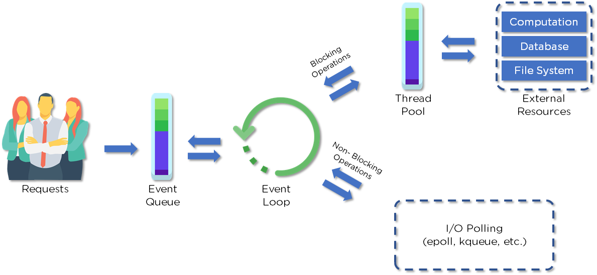

# Asynchronous programming and API server

Trong bài học này chúng ta tìm hiểu các vấn đề sau:

- Introducing the Event Loop
- Understanding callbacks and Error-First Pattern
- Using async.js Library
- Using promises
- Making AJAX calls
- Building RESTful Web Services
- Developing REST APIs
- Mocking Up CRUD
- Testing APIs with cURL


## 💛 Introducing the Event Loop

Event loop trong Node.js là một thành phần quan trọng trong kiến trúc single-threaded (đơn luồng) của nó. Nó cho phép Node.js xử lý nhiều yêu cầu đồng thời mà không cần tạo ra các luồng bổ sung.

Trong Node.js, mã JavaScript chạy trong một luồng duy nhất, còn được gọi là luồng chính (main thread). Tuy nhiên, để xử lý các yêu cầu I/O không đồng bộ, như đọc và ghi vào tệp, gọi API mạng hoặc truy vấn cơ sở dữ liệu, Node.js sử dụng mô hình sự kiện và non-blocking I/O.





Client gửi các REQUEST đến SERVER để tương tác với ứng dụng web. Các REQUESTs này có thể là Blocking hoặc Non-Blocking

- Truy vấn dữ liệu
- Xóa dữ liệu
- Cập nhật dữ liệu

Node.JS tiếp nhận các Request gửi đến và thêm chúng vào hàng đợi Event Queue

Sau đó các yêu cầu (Request) này được xử lý lần lượt thông qua Event Loop.

Event loop là một vòng lặp vô tận để kiểm tra các sự kiện và thực hiện các callback tương ứng. Nó cũng điều khiển việc thực hiện các tác vụ khác trong chương trình Node.js, như đọc và ghi từ các I/O, gửi và nhận dữ liệu từ mạng, v.v.

Có hai loại sự kiện mà event loop xử lý: sự kiện đồng bộ và sự kiện bất đồng bộ

- Sự kiện đồng bộ được xử lý ngay lập tức trong vòng lặp event loop
- Sự kiện bất đồng bộ được đưa vào một hàng đợi và xử lý sau khi các sự kiện đồng bộ đã được xử lý xong

## 💛 Understanding callbacks and Error-First Pattern

### Callbacks là gì?

Xem ở đây [Callbacks](2.Async-Await/callback-deep.md)

### Error-First Pattern

Error-First Pattern (mẫu lỗi đầu tiên) là một phong cách lập trình phổ biến trong Node.js và các ngôn ngữ khác khi làm việc với các hàm không đồng bộ (asynchronous functions) hoặc các hàm có khả năng xảy ra lỗi.

Theo Error-First Pattern, khi một hàm không đồng bộ được gọi, callback được truyền vào như một tham số cuối cùng. Callback này sẽ có hai tham số đầu tiên: một tham số để nhận lỗi (error) (nếu có) và một tham số để nhận kết quả (result) (nếu thành công). Nếu không có lỗi xảy ra, tham số lỗi sẽ là `null` hoặc `undefined`, và tham số kết quả sẽ chứa dữ liệu trả về. Ngược lại, nếu có lỗi xảy ra, giá trị của tham số lỗi sẽ là một đối tượng lỗi (error object), và tham số kết quả sẽ không được sử dụng.

Sử dụng Error-First Pattern giúp đảm bảo rằng lỗi được xử lý một cách thích hợp và không bị bỏ qua. Nó cũng giúp mã nguồn dễ đọc hơn và dễ hiểu hơn vì việc kiểm tra lỗi được thực hiện một cách rõ ràng.

Ví dụ minh họa sử dụng Error-First Pattern trong Node.js:

```javascript
function readFile(path, callback) {
  fs.readFile(path, 'utf8', function(error, data) {
    if (error) {
      callback(error); // Gọi callback với lỗi (error)
    } else {
      callback(null, data); // Gọi callback với kết quả (data)
    }
  });
}

// Sử dụng hàm readFile với Error-First Pattern
readFile('file.txt', function(error, data) {
  if (error) {
    console.error('Đã xảy ra lỗi:', error);
  } else {
    console.log('Dữ liệu:', data);
  }
});
```

Trong ví dụ trên, hàm `readFile` đọc một file từ đường dẫn được chỉ định và gọi callback với lỗi (nếu có) hoặc dữ liệu (nếu thành công). Trong hàm callback, chúng ta kiểm tra giá trị của tham số lỗi và thực hiện xử lý tương ứng.

Error-First Pattern là một quy ước được khuyến nghị trong Node.js và được sử dụng rộng rãi trong các thư viện và framework của Node.js để xử lý lỗi và kết quả của các hàm không đồng bộ.

***

## 💛 Xử lý tác vụ bất đồng bộ 


Trước tiên ta di tìm hiểu VÌ SAO lại cần xử lý BẤT ĐỒNG BỘ thông qua một ví dụ:

Tìm một người tên là 'john' có trong Database

```js
//Mô phỏng trả về một mảng users từ Database
function getUsers() {
  return [
    { username: 'john', email: 'john@test.com' },
    { username: 'jane', email: 'jane@test.com' },
  ];
}
// Định nghĩa hàm Tìm user có tên john
function findUser(username) {
  const users = getUsers(); 
  const user = users.find((user) => user.username === username);
  return user;
}
//Gọi hàm 
console.log(findUser('john'));

//Kết quả
{ username: 'john', email: 'john@test.com' }

```

Chúng ta thấy chưa có điều gì xảy ra với ví dụ trên. Vì `getUsers()` return về mảng user quá nhanh, để bạn có thể sử dụng find tìm.

Nhưng trong thực tế khi lấy mảng users từ Database nó phải mất một thời gian nhất định.

Để mô phỏng nó tốn thời gian để lấy dữ liệu xong mới trả về mình sửa `getUsers()` lại như sau:

```js
function getUsers() {
  let users = [];
  //Sử dụng setTimeout để Delay 3 giây
  setTimeout(() => {
    users = [
      { username: 'john', email: 'john@test.com' },
      { username: 'jane', email: 'jane@test.com' },
    ];
  }, 3000);
  return users;
}

console.log(findUser('john'));

//Output
undefined
```

Giải thích:

- Bản chất các tiến trình của Javascript là đồng bộ
- Tại hàm `findUser`, lấy mảng users và tìm user xảy ra đồng thời. Chứ nó không đợi tìm được users rồi mới đi tìm kiếm người tên `john` 
- Chính vì vậy kết quả là `undefined`

**💘 KHẮC PHỤC**

- Sử dụng Callback để xử lý bất động bộ ở trên. Tuy nhiên cách này có thể gây ra một vấn đề gọi là [Callback Hell](2.Async-Await/callback-hell-deep.md)
- Sử dụng Promises: ES6
- Sử dụng Async/await ES8

## 💛 Using promises

Xem ở đây [Promises](2.Async-Await/Promises.md)
## 💛 Using async.js Library

Xem ở đây [Async/await](2.Async-Await/async-await.md)

## 💛 Making AJAX calls

Cách gửi request lên server với một tác vụ bất đồng bộ.

## 💛 Building RESTful Web Services

Xem ở đây [RESTful](Restful-API.md)

## 💛 Developing REST APIs

Phát triển tiếp các API khác tại mục Homeworks/Database-Structure
## 💛 Mocking Up CRUD

Tạo data TEST cho hệ thống CURD với thư viện <https://fakerjs.dev/>

## 💛 Testing APIs with cURL